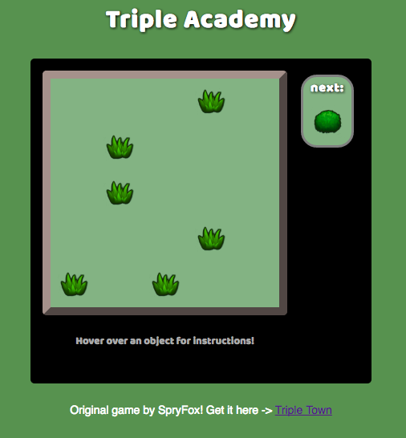

#Triple Academy
Inspired by TripleTown by SpryFox

<!-- [Triple Academy live](https://e90216.github.io/Triple-Academy/) -->

Triple Academy is a puzzle game in which the player must match objects in groups of three. Three or more adjacent objects of the same kind combine at the location of the last placed object of that group, into an object of the next tier, e.g. three bushes combine to form one tree. Objects must be in vertically or horizontally adjacent spots to combine (this can be in lines of three or in L shapes).

##Technologies, Languages
* Javascript
* jQuery
* HTML5
* CSS3

##Features and implementation
###Random object generation/setting up the board

###Checking for adjacent objects
* Since the Game class is in charge of all of the pieces, it can also check for adjacent matches. The challenge was checking for adjacent matches of those matches.

###Combining multiple tiers
* Okay, so once we got the logic of finding matches down, all we have to do it combine them, right! Well, sure! But if you have two bushes, waiting to become a tree, AND two trees already built and ready to become a hut, wouldn't you want that last bush to become a tree, then a hut? Of course you would!
[screenshots]

###Adding movement to the objects
* adding preview on hover
* Like in the original version of this game, I wanted to add movement to the objects to make it clear where they want to join, i.e. if the next item is a grass object, and you are hovering over a spot with two adjacent grass objects, they will bounce toward that spot so as to alert you that they want to join there. That's all they want. Don't you want them to be happy?
[gif]

##Features to come
* Bears! These are special objects that can move around the board. They will be a child class of Piece, with a special "walk" function.
* Saving the current object for later/swapping objects (like in tetris)
* Other special objects--crystal (wildcard, combines any matching 2+ objects into the next tier), bot (removes a piece from the board)
* Scoring
* Sound effects
