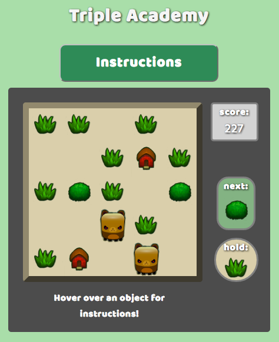
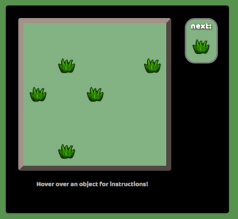
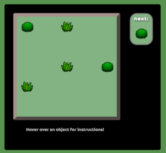
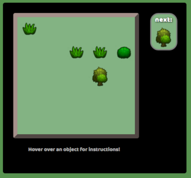
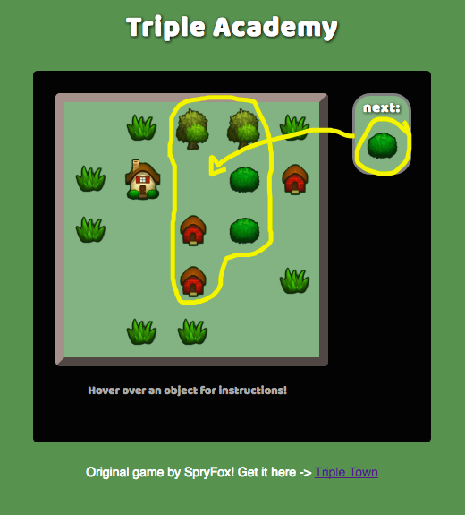
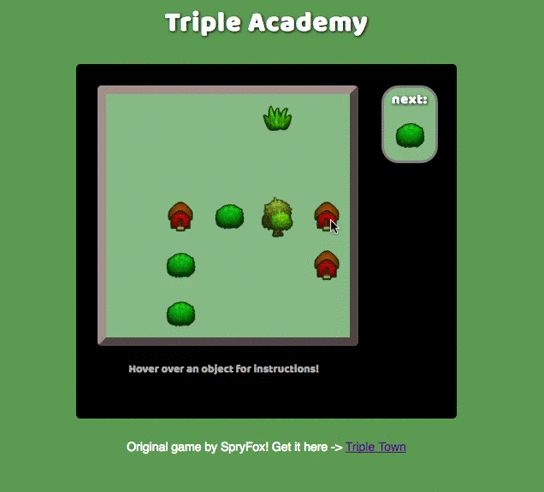
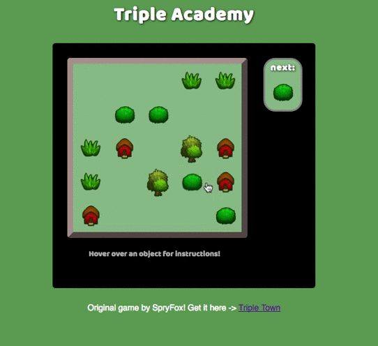

#Triple Academy
Inspired by TripleTown by SpryFox

[Triple Academy live](www.estherpong.com/Triple-Academy/)



Triple Academy is a puzzle game in which the player matches objects in groups of three. Three or more adjacent objects of the same kind combine at the location of the last placed object of that group, into an object of the next tier, e.g. three bushes combine to form one tree. Objects must be in vertically or horizontally adjacent spots to combine (this can be in straight lines or in L shapes).

##Technologies, Libraries
* Javascript
* jQuery
* HTML5
* CSS3

##Features and implementation
###Random object generation/setting up the board
* The initial setup of the board (aka the pieces you start with) are randomly generated by the Game class, each time it is instantiated. The object given to you to place is randomly generated at each turn. A file of constants keeps track of all of the objects, as well as the frequency with which they should appear.

  

###Combining multiple tiers
* Since the Game class is in charge of all of the pieces, it is also tasked with checking for adjacent matches.

```javascript
let isMatching = (pos) => {
  if(board.isValidGridPos(pos)) {
    return board.grid[pos[0]][pos[1]].value === pieceValue;
  } else {
    return false;
  }
};

let storePos = (directions, pos) => {
  if(!Array.isArray(directions)) { directions = [directions]; }
  directions.forEach( (dir) => {
    this.adjacentsObj[dir].push(pos);
  });
};

for(let dir in DIRECTIONS) {
  let pos = [currentRow + DIRECTIONS[dir][0], currentCol + DIRECTIONS[dir][1]];
  if(isMatching(pos)) {
    storePos(dir, pos);
    for(let dir2 in DIRECTIONS) {
      let pos2 = [pos[0] + DIRECTIONS[dir2][0], pos[1] + DIRECTIONS[dir2][1]];
      if(!(pos2[0] === currentRow && pos2[1] === currentCol) && isMatching(pos2)) {
        storePos([dir, dir2], pos2);
      }
    }
  }
}
```

```javascript
this.setAdjacentMatchingPositions(clickedCellPos);
while(this.multAdjacentsExist()) {
  let biggerPiece = this.combine(clickedCellPos); //combine them
  this.score += biggerPiece.value;

  if(biggerPiece.value === 6) { //mansion to win
    this.won = true;
  }

  this.setAdjacentMatchingPositions(clickedCellPos, biggerPiece.value); //check that that doesn't need to be combined
}
```

* Okay, so once we've gotten the logic of finding matches down, all we have to do it combine them, right! Well, sure! But, if you have two bushes, waiting to become a tree, and two trees already built and ready to become a hut, AND two huts waiting to become a house, wouldn't you want that last bush to first become a tree, and then also combine with the other trees to become a hut, and then combine with the huts to become a house? Of course you would!

 

###Adding movement to the objects
* A preview of the object appears on the board, where you are hovering.
* Like in the original version of this game, I wanted to add movement to the objects to make it clear where they want to join, i.e. if the next item is a grass object, and you are hovering over a spot with two adjacent grass objects, they will bounce toward that spot so as to alert you that they want to join there. That's all they want. Don't you want them to be happy?



* And it's not just the same objects that will bounce--all of the objects that want to combine will bounce towards your cursor.



### Bears!
* Bears are instances of a child class of Piece. They behave a little differently, in that three adjacent bears don't combine into an object of the next tier. Also--and this is important--they don't stay in one place. Each turn, bears that have empty spaces next to them will choose one at random to "walk" into.

##Features to come
* Saving the current object for later/swapping objects (like in tetris)
* Other special objects--crystal (wildcard, combines any matching 2+ objects into the next tier), bot (removes a piece from the board)
* Scoring
* Sound effects
